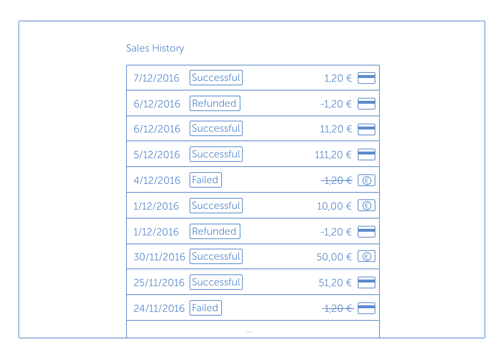
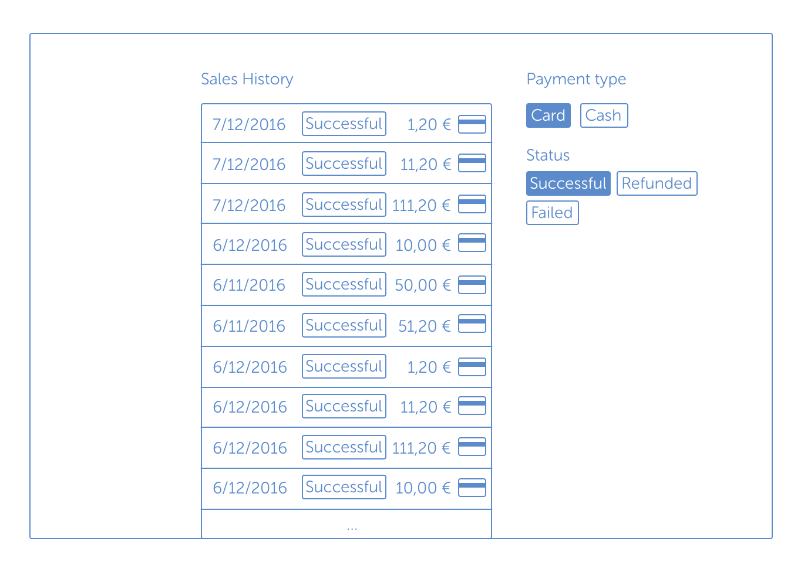
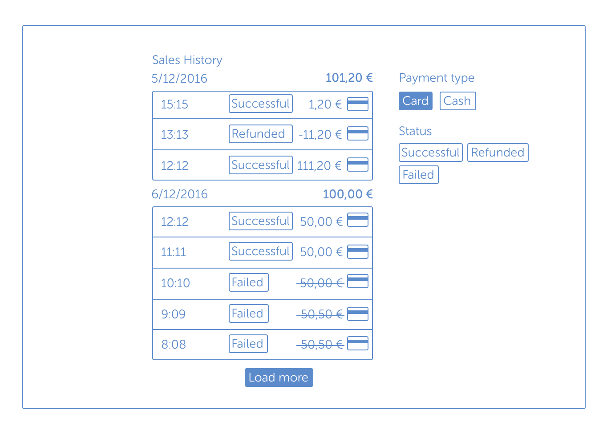

# Build your own Sales History

## Summary of the task

### Phase 1: Basic list of sales

Your task is to generate a dataset containing 6 months worth of sales, and then display that in a simple list view. You must generate the data programmatically, and may not use a third-party generator. You can use the Express server provided to create an endpoint, which will provide a subset of this data to the client (perhaps initially limited to 100 sales items or so). The sales should be listed with newest sales first, and the UI could look like this.



### Phase 2: Filtering sales by payment method & status

In this phase, you should add filtering to your API, and allow the client to update these filters. It should be possible to filter the transactions by payment type (card or cash) and payment status (successful, failed, refunded), or any combination of these filters.



### Phase 3: Aggregate data in groups by day, add daily totals, "Load More" functionality

Finally, you'll put the finishing touches on your Sales History. First, each day should have its own section in the UI, visually-speaking. Above each day, you should list the date and the total from the successful transactions that happened that day. Lastly, you should add a "Load More" button which will allow merchants to see older transactions.



## Getting started

### Guiding principles

* Strive for a balance between 'doing it right' and 'not overengineering' based on the task
* Think about code you would put in a shared codebase
* When in doubt, ask!

### Your tools

* An Express server, equipped with Nodemon so it restarts upon changes
* React base app with a library for HTTP requests (axios)
* Frontend is built by webpack, based on create-react-app

### Get it running

```bash
npm start # Run client
npm run start:server # Run server
npm test # Run tests
```
